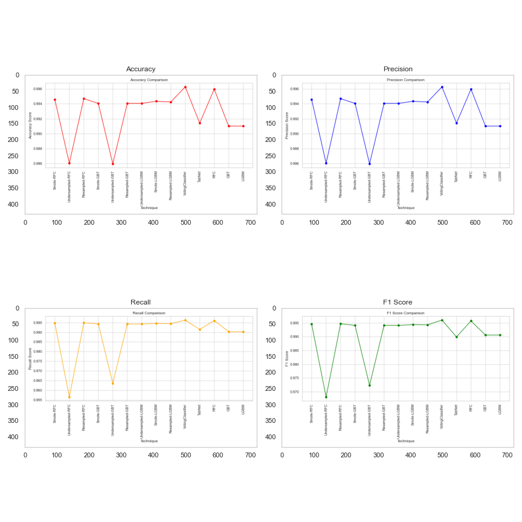
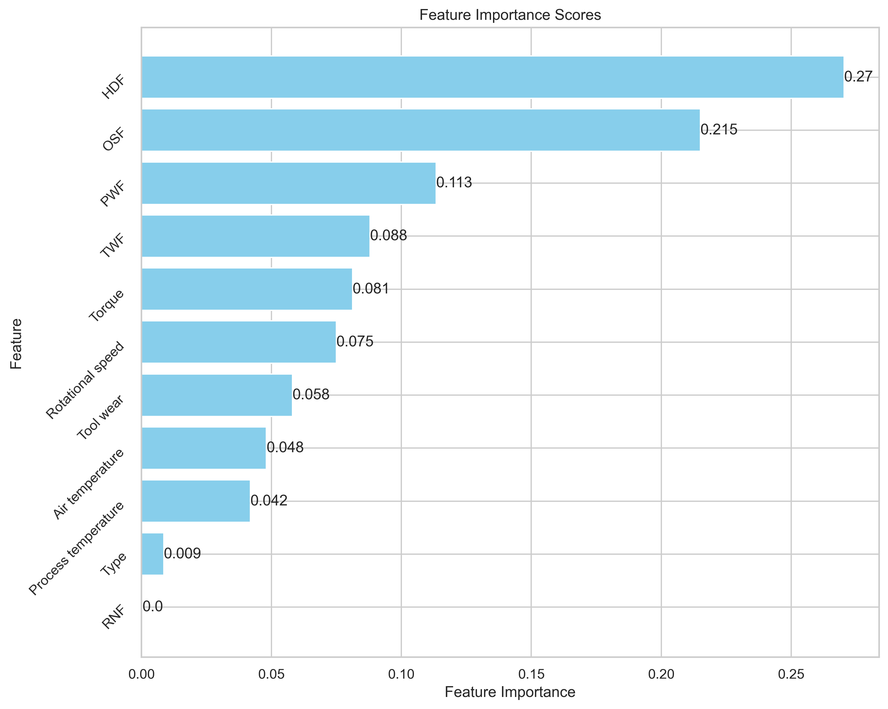

# Project Title

The Kaggle challenge on Binary Classification of Machine Failures presents a synthetic tabular
dataset within the Kaggle playground series. The core objective is to develop a robust machine
learning model capable of effectively categorizing machine failures. This project employs a diverse
set of approaches, starting with individual models like Random Forest Classifier, Gradient
Boosting Classifier, LightBGM. The models, RFC (Random Forest Classifier), and LGBM
(Light Gradient Boosting Machine), exhibit remarkable performance across all metrics, boasting
precision, recall, F1 Score, and accuracy scores.

## Table of Contents
- [Introduction](#introduction)
- [Features](#features)
- [Usage](#usage)
- [Data](#data)
- [Models](#models)
- [Results](#results)
- [Contributing](#contributing)

## Objective
This is a binary classification problem. The goal of this competition is to predict whether a machine
will fail or not, based on a set of features such as air temperature, process temperature, rotational
speed, torque, tool wear, and product ID. Submissions are evaluated on area under the ROC curve
between the predicted probability and the observed target. The provided training dataset has
136429 rows x 13 columns and the testing dataset 90954 rows x 12 columns.

## Features
| Feature                   | Description                                                                                                      | Train | Test |
|---------------------------|------------------------------------------------------------------------------------------------------------------|-------|------|
| Product ID                | Unique failure ID                                                                                                | 9976  | 9909 |
| Type                      | Type of failure                                                                                                  | 3     | 3    |
| Air Temperature           | Temperature of the surrounding air where a machine or process is operating                                       | 95    | 92   |
| Process Temperature       | Temperature of a substance or material within a manufacturing or industrial process                               | 81    | 84   |
| Rotational Speed          | Speed at which a component revolves                                                                              | 952   | 946  |
| Torque                    | Measure of the rotational force applied to a component                                                            | 611   | 595  |
| Tool wear                 | Gradual deterioration of cutting tools or abrasive materials used in machining or manufacturing processes       | 246   | 246  |
| Machine Failure           | Binary variable indicating whether or not the machine failed                                                      | 2     | 2    |
| Time to Failure (TWF)     | Amount of time it takes for a machine or system to fail after being put into operation                            | 2     | 2    |
| Health Diagnostic Feature (HDF) | Features or data points indicative of the health or condition of a machine                                | 2     | 2    |
| Predictive Warning Flag (PWF)   | System or indicator that issues warnings or alerts when it predicts a potential machine failure           | 2     | 2    |
| Operational Status Flag (OSF)  | Used to indicate the current operational status of a machine (e.g., 0 for operational, 1 for non-operational) | 2     | 2    |
| Remaining Useful Life (RNF)    | Estimated or predicted remaining lifespan of a machine or component before it is expected to fail         | 2     | 2    |

## Usage
1. Download the dataset: [Kaggle Competition Link](https://www.kaggle.com/competitions/playground-series-s3e17/discussion)
2. [Exploratory Data Analysis](src/EDA.ipynb)
3. [Preprocessing- cleaning/encoding](src/Preprocessing.ipynb)
4. [Dimensionality Reduction - PCA](src/PCA.ipynb)
5. [Feature Selection](src/FinalPresentation.ipynb)
6. [Sampling Experiments](src/Sampling-Modeling.ipynb)
7. [Hypertuning](src/Hyper-Modeling.ipynb)

The figures outputted by the notebooks can be found: [Figs](https://github.com/MElizondo1121/AdvML-Project/tree/main/figs)

## Data

| Column                   | Non-Null Count | Dtype   |
|--------------------------|----------------|---------|
| id                       | 136429         | int64   |
| Product ID               | 136429         | object  |
| Type                     | 136429         | object  |
| Air temperature [K]      | 136429         | float64 |
| Process temperature [K]  | 136429         | float64 |
| Rotational speed [rpm]   | 136429         | int64   |
| Torque [Nm]              | 136429         | float64 |
| Tool wear [min]          | 136429         | int64   |
| Machine failure          | 136429         | int64   |
| TWF                      | 136429         | int64   |
| HDF                      | 136429         | int64   |
| PWF                      | 136429         | int64   |
| OSF                      | 136429         | int64   |
| RNF                      | 136429         | int64   |

| Column                   | Non-Null Count | Dtype   |
|--------------------------|----------------|---------|
| id                       | 136429         | int64   |
| Product ID               | 136429         | object  |
| Type                     | 136429         | object  |
| Air temperature [K]      | 136429         | float64 |
| Process temperature [K]  | 136429         | float64 |
| Rotational speed [rpm]   | 136429         | int64   |
| Torque [Nm]              | 136429         | float64 |
| Tool wear [min]          | 136429         | int64   |
| Machine failure          | 136429         | int64   |
| TWF                      | 136429         | int64   |
| HDF                      | 136429         | int64   |
| PWF                      | 136429         | int64   |
| OSF                      | 136429         | int64   |
| RNF                      | 136429         | int64   |

## Models
- Outline the models, algorithms, or methodologies used in the project.
- Include information on how to train, test, or deploy these models (if applicable).

## Results
The models, including VotingClassifier, RFC (Random Forest Classifier), and LGBM (Light Gradient Boosting Machine), exhibit remarkable performance across all metrics, boasting precision, recall, F1 Score, and accuracy scores consistently above 99\%. These results highlight their effectiveness in accurately classifying instances, showcasing robust predictive capabilities.
Sampling Techniques and Model Stability. Different sampling methodologies, such as SMOTE, undersampling, and resampling, demonstrated comparable performance enhancements across various models. This suggests the stability and reliability of these techniques in improving model performance and handling imbalanced datasets.
While the evaluated models showcase high predictive accuracy, certain models, notably the VotingClassifier and TabNet, display exceptionally high scores, possibly indicating overfitting tendencies. This calls for cautious consideration regarding their generalizability on unseen data and their practical applicability.

*Figure 1: Accuracy, Precision, Recall and F1 scores.*

*Figure 1: Random Forest Feature Selection.*

## Contributing
Mirna:
- Random Forest & Gradient Boosting Models
- Sampling / PCA experiments

Aakash:
- Support Vector Machine Model
- Ensemble Model
- TabNet implementation
